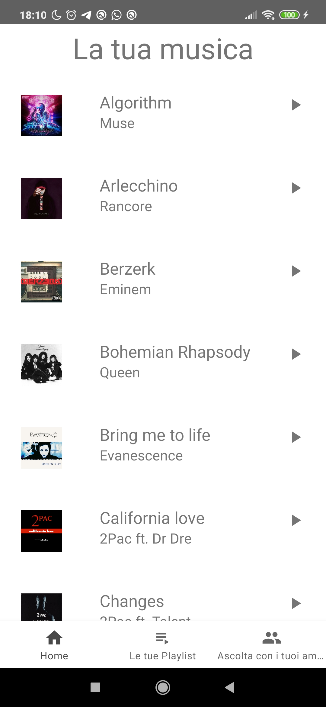
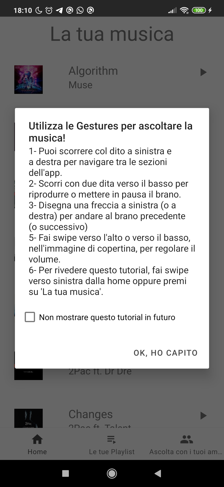

# Sharing SongFy
## Descrizione

Sharing SongFy è un'app che offre lo streaming di brani musicali on demand, simile alla famosa app Spotify. Una principale differenza stilistica dal classico Spotify è la possibilità di controllare la musica tramite delle gesture. 
Su Sharing SongFy è inoltre possibile anche condividere ciò che si sta ascoltando con i propri amici.

## Utilizzo

Dopo l'installazione, verrà chiesto di autenticarsi mediante il numero di telefono. Una volta inserito il codice di verifica, si aprirà poi la home page dell'app, contenente l'elenco completo delle canzoni disponibili attualmente nel server. Al primo avvio apparirà un breve tutorial che spiega il funzionamento delle gestures.

 

### Gestures

Premendo dunque su una canzone, si aprirà la schermata con le informazioni dell'attuale brano in riproduzione, dal quale sarà possibile effettuare le gestures. Per alzare o abbassare il volume ad esempio, occorre fare swipe verso l'alto o il basso come indicato in figura dalla linea verde:

 

Per mettere invece in pausa, occorre disegnare due linee verticali verso il basso con 2 dita contemporaneamente, e rifacendolo si rimetterà play:

 

Infine, per andare alla canzone precedente o successiva, occorre disegnare delle punte di freccia verso sinistra o verso destra, come in figura:

 

### Notifica
C'è la possibilità di controllare la musica anche tramite la barra delle notifiche senza aprire l'app, o persino mentre si ha lo schermo bloccato, con i classici pulsanti:

 
Premendo inoltre sulla notifica, sarà possibile riaprire la schermata dove è possibile controllare la musica con le gestures.

### Playlist
Come molte app di streaming musicale, anche Sharing SongFy da la possibilità all'utente di creare playlist. Utilizzando il menù in basso o facendo Swipe verso sinistra, si accederà infatti alla pagina "Le tue playlist", dove è possibile creare, rinominare ed eliminare playlist con la musica desiderata. Dopo aver premuto sul pulante, apparirà un dialog dove va indicato il nome della Playlist:

 

Dopodichè verrà visualizzato un elenco da cui sarà possibile scegliere le canzoni da inserire. Una volta creata la playlist, basta cliccarci sopra per aprirla per poter ascoltare la musica inserita o modificarla:

 

Cliccando sul + in alto a destra, sarà possibile aggiungere nuove canzoni dal medesimo elenco. Per eliminare una canzone invece, basta tener premuto su questa e premere sul tasto "Elimina". Per rinominare o eliminare una playlist, basta tener premuto sulla playlist in questione dalla schermata con l'elenco delle playlist.

### Ascolto condiviso

Su Sharing SongFy è inoltre possibile condividere la musica che si sta ascoltando con i propri amici, oppure ascoltare cosa questi ultimi stanno riproducendo, in tempo reale. Premendo sul terzo bottone o facendo swipe verso destra dalla schermata delle playlist, è possibile accedere alla schermata dell'ascolto condiviso. Per farlo però, occorre autorizzare l'accesso ai contatti. Dopodichè, sarà possibile visualizzare l'elenco dei contatti che sono in possesso dell'app e che stanno attualmente condividendo qualche canzone:

 

Premendo su un contatto, partirà un servizio in background che permette la riproduzione in tempo reale di ciò che l'amico sta ascoltando. In basso inoltre, apparirà una notifica contenente le informazioni sul brano. Per rivedere queste informazioni, basterà tener premuto sul contatto in questione. Per fermare la canzone, occorre invece ripremere sul nome dell'amico di cui si stava ascoltando, oppure, se non si è sull'app, è sufficiente premere sull'icona che appare nella barra delle notifiche. Per condividere invece ciò che si sta ascoltando con gli altri, è sufficiente premere sul pulsante "Condividi Musica" in basso.

## Overview Struttura

Sono inoltre presenti anche una serie di classi custom.

### OnSwipeTouchListener

Questa classe serve per gestire gli swipe per la navigazione tra un fragment e l'altro. Questo tramite l'inner class che estende SimpleGestureListener della classe GestureDetector.

Ho preso spunto dalla seguente classe in Kotlin che ho trovato in rete:

https://www.codegrepper.com/code-examples/whatever/kotlin+swipe+listener

### Iso2Phone
Questa classe serve per mappare gli ISO code di ogni paese con il prefisso telefonico corrispondente. In particolare è servita per autocompletare l'EditText del prefisso del numero di telefono in maniera automatica.
Ho trovato questa repo online:

https://github.com/cognalys/cognalys-android-library/blob/master/src/com/matesnetwork/callverification/Iso2Phone.java

### CreateNotification
Questa classe serve per creare la notifica contenente i controlli del MediaPlayer. Ad ogni pulsante corrisponde un'action che viene mandata in broadcast dalla classe NotificationActionService.

### JsonParserUrl
Siccome le canzoni sono tutte indicizzate da un file JSON su un server, che contiene tutti i dati relativi di ogni canzone (titolo, artista, feat, url copertina, url file mp3), c'era bisogno di una modo per scaricare questo file .json e parsarlo di modo da riempire un oggetto custom Song. Questo è stato possibile grazie alla libreria Gson

https://sites.google.com/site/gson/gson-user-guide

### Oggetti custom
Sono stati necessari diversi oggetti custom per rappresentare gli elementi utili per l'app, come ad esempio l'oggetto Song che contenesse tutti i dati di un brano musicale, l'oggetto Playlist che altro non è che una lista di canzoni associata a un nome, e l'oggetto Friend, che contiene invece i dati di ogni utente registrato all'app. Tra i dati salvati vi è infatti lo user id di FirebaseAuth, il nome associato al contatto, il numero di telefono, la canzone che sta correntemente ascoltando e la posizione (in millisecondi) di essa. Tutte implementano Serializable, questo per poter essere passate tra varie Activity come Extra negli Intent.

### Interfacce
L'interfaccia SongSelected è servita sostanzialmente per poter capire quali fossero le canzoni selezionate dalla RecyclerView, per esempio nell'adapter relativo al dialog per creare una Playlist. L'interfaccia Playable invece è servita per la rappresentazione degli elementi "Riproducibili", ovvero per interpretare le varie azioni da compiere sul brano in base a ciò che viene ricevuto in broadcast.

### Altri riferimenti
Per molti aspetti del progetto, quali ad esempio l'oggetto MediaPlayer per la riproduzione dei brani, ho fatto un largo uso della documentazione ufficiale di Android (https://developer.android.com/guide). Ho inoltre anche consultato le documentazioni ufficiali per l'utilizzo dell'autenticazione tramite numero di telefono e per l'utilizzo del Realtime Database di Firebase (https://firebase.google.com/docs/auth ) e (https://firebase.google.com/docs/database). Per il caricamento delle cover degli album musicali ho inoltre usato la libreria Picasso (https://square.github.io/picasso/).