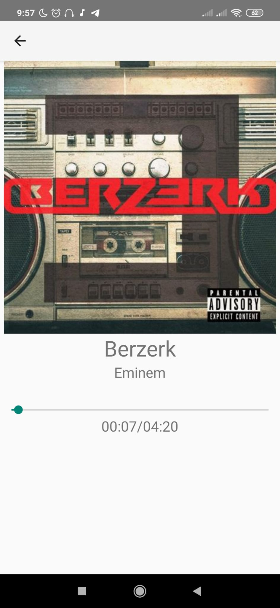

# Sharing SongFy
## Descrizione

Sharing SongFy è un'app che offre lo streaming di brani musicali on demand, simile alla famosa app Spotify. Una principale differenza stilistica dal classico Spotify è la possibilità di controllare la musica tramite delle gesture. Una volta aperto un brano infatti, la riproduzione parte in maniera automatica. Per poter regolare il volume è possibile scorrere con il dito, nella parte inferiore destra dello schermo, in su e in giù per alzare e abbassare il volume. Per poter mettere pausa, è sufficiente trascinare due dita in un punto arbitrario dello schermo verso il basso. Con lo stesso gesto è possibile inoltre rimettere play. Per passare alla canzone successiva, bisogna disegnare con le dita una punta di freccia rivolta verso destra, mentre per andare alla canzone precedente la cosa è analoga, ma verso sinistra. Naturalmente è possibile controllare la musica anche in maniera "standard", grazie alla notifica presente nella barra delle notifiche, che viene creata al primo avvio di una canzone. All'apertura della notifica è possibile visualizzare nuovamente la schermata di controllo tramite gestures.
Su Sharing SongFy è inoltre possibile anche condividere ciò che si sta ascoltando con i propri amici. Questo è il motivo per cui per poter utilizzare l'app bisogna registrarsi tramite numero di telefono, poichè la lista di amici è presa direttamente dai contatti della rubrica che hanno la medesima app. Nella sezione "Ascolta con i tuoi amici", premendo sull'apposito pulsante è possibile condividere ciò che è attualmente in riproduzione con chiunque abbia scaricato l'app e abbia il numero in rubrica. Per poter ascoltare cosa ascolta un amico, è sufficiente premere sul suo nome nella lista. È possibile ascoltare un solo amico per volta (altrimenti l'audio sarebbe sovrapposto), e per rivedere quale canzone sta ascoltando occorre tenere premuto fino alla vibrazione.
## Immagini

 

## Struttura

//TODO
